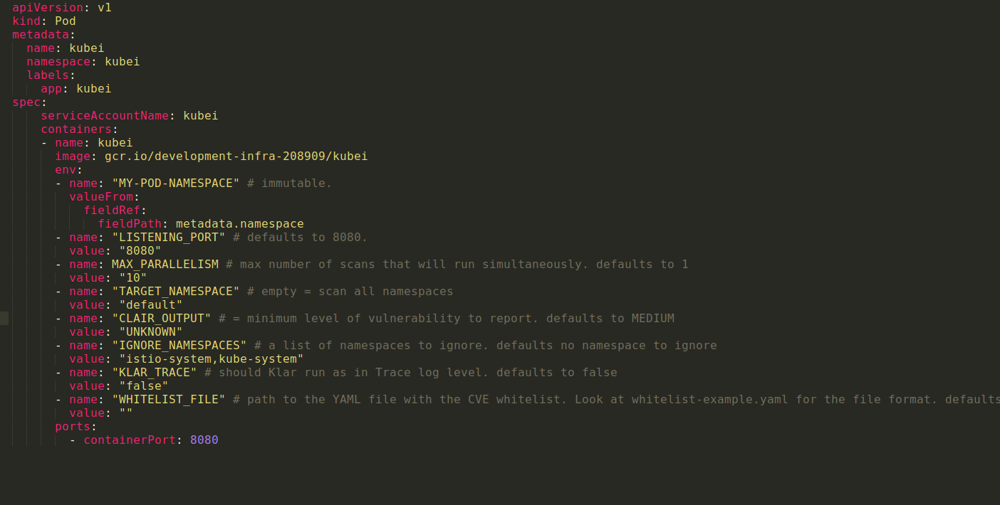
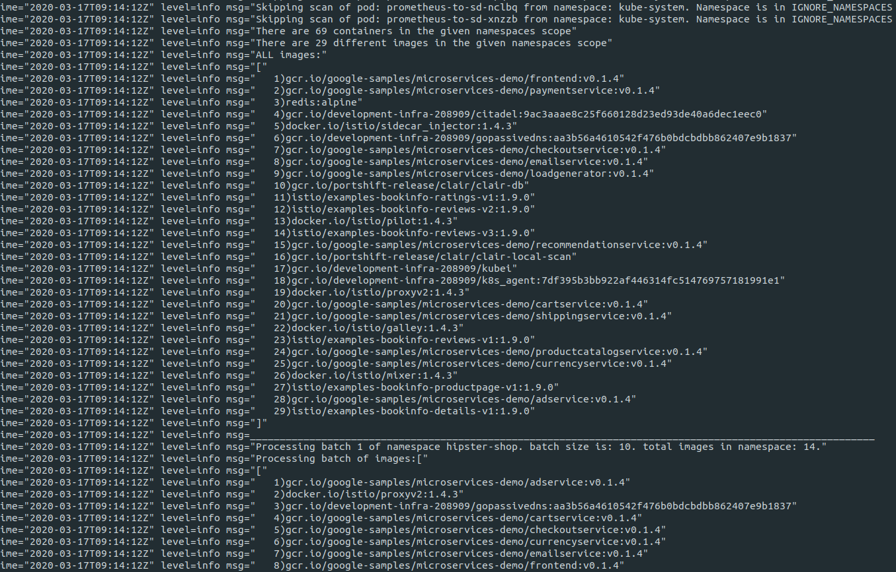
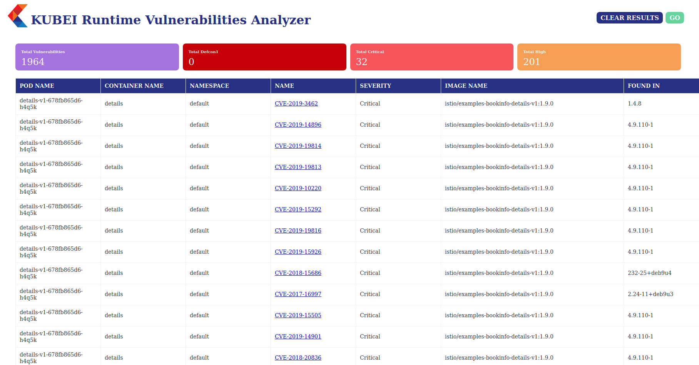

# Kubei 

Kubei is a vulnerabilities scanning tool that allows users to get an accurate and immediate risk assessment of their kubernetes clusters. Kubei scans all images that are being used in a Kubernetes cluster, including images of application pods and system pods. It doesn’t scan the entire image registries and doesn’t require preliminary integration with CI/CD pipelines. 

It’s a configurable tool which allows users to define the scope of the scan (target namespaces), it’s speed and the vulnerabilities level of interest.

It provides a graphical UI which allows the viewer to identify where and what should be replaced in order to mitigate the discovered vulnerability. 


## Prerequisites 

1. Kubernetes cluster is ready and kubeconfig ( ```~/.kube/config```) is properly configured for the target cluster.

## Configurations 

1. The file ```kubei.yaml``` is used to deploy and configure Kubei on your cluster.

   

1. Set the scan scope. Set the parameter ```ignore namespaces``` to ignore specific namespaces.

1. Set the scan speed. Expedite scanning by running parallel scanners. Set the ```max-parallelism``` field for the maximum number of simultaneous scanners.

## Use 

1. Run the following command to deploy Kubei on the cluster:

    ```
    kubectl apply -f kubei.yaml 
    ```

2. Then, run this command to configure the port for communication:

    ```
	kubectl -n kubei  port-forward kubei <port>:8080 
    ```    
	For example, to configure port 5556:
	
	```kubectl -n kubei  port-forward kubei 5556:8080```

3. In your browser, navigate to http://localhost:port/view/ and then click  'GO' to run a scan (for example: http://localhost:5556/view/)

4. To check the state of Kubei, and the progress of ongoing scans, run the following command:

    ```
	kubectl -n kubei  port-forward kubei <port>:8080  
    ```
	
	For example, for port 5556:
	
	```kubectl -n kubei  port-forward kubei 5556:8080```



5. Refresh the page (http://localhost:port/view/) to update the results.

     


## Limitations 

1. Supports Kubernetes Image Manifest V 2, Schema 2 (https://docs.docker.com/registry/spec/manifest-v2-2/). 

It will fail to scan on earlier versions.
 
2. The CVE database will update once a day.